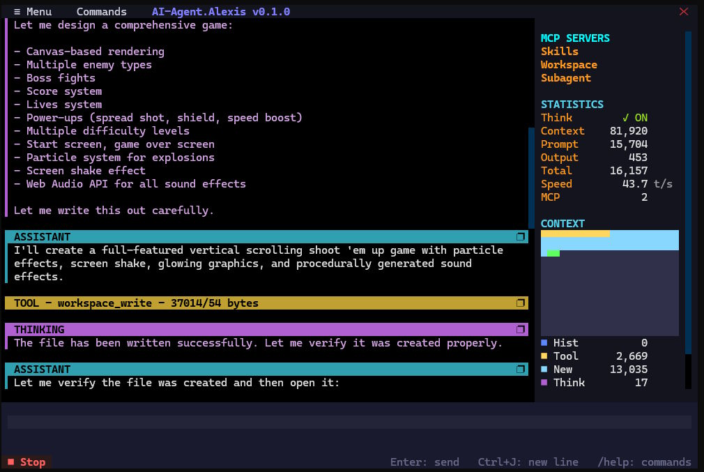

# AI-Agent.Alexis

A multimodal LLM agent CLI with **MCP (Model Context Protocol)** support. Stream text and images to an LLM server, give the model tools via MCP, and interact through several UI modes — a simple one-shot console, an interactive terminal loop, a rich Textual TUI, or an HTTP API server.



The architecture is built around two independent plugin systems:

- **LLM drivers** — choose the backend provider (`llama`, `gemini`).
- **UI drivers** — choose the interaction mode (`simple`, `interactive`, `textual`, `api`).

---

## Requirements

- Python **3.9+**
- An LLM server endpoint (e.g. a local `llama-server` exposing `/v1/chat/completions`, or a Gemini-compatible gateway).

## Installation

The project installs as an **editable** package, which exposes an `alexis` command in your terminal. Editable install is the supported method: the agent re-spawns itself as a subprocess and loads bundled MCP servers (`mcp/`) and skills (`.agents/`) relative to its own location, so the files must stay in place.

```bash
# from the project root
pip install -e .            # core (MCP)
pip install -e ".[api]"     # + HTTP API server mode (aiohttp)
pip install -e ".[tui]"     # + Textual TUI
pip install -e ".[all]"     # everything
```

After installing, you can run the agent from anywhere:

```bash
alexis --version
alexis --help
```

> **Windows PATH note:** pip installs the `alexis` command into your Python user `Scripts` directory
> (e.g. `%APPDATA%\Python\Python3xx\Scripts`). If `alexis` isn't found, add that folder to your `PATH`
> and open a new terminal.

---

## Quick start

```bash
# One-shot prompt (simple mode)
alexis "What is the capital of France?"

# Save the final answer to a file
alexis "Explain quantum computing" -o output.txt

# Interactive terminal chat (auto-selects the Textual TUI if available)
alexis --interactive

# Explicit UI mode
alexis --ui-driver textual        # rich TUI with mouse support
alexis --ui-driver interactive    # plain terminal loop
alexis --ui-driver simple         # non-interactive

# HTTP API server (SSE streaming) for GUI clients
alexis --api-port 8000
```

By default Alexis talks to `http://127.0.0.1:8080/v1/chat/completions`. Override it with `--url`.

---

## Choosing a backend (LLM driver)

```bash
# Local llama.cpp server (default driver)
alexis "prompt" --llm-driver llama --url http://localhost:8080/v1/chat/completions

# Gemini-compatible gateway
alexis "prompt" \
  --llm-driver gemini \
  --url https://your-gemini-gateway/v1/chat/completions \
  --api-key YOUR_API_KEY \
  --model gemini-2.5-flash
```

`--api-key` can also be supplied via the `API_KEY` environment variable.

---

## Choosing an interface (UI driver)

| Driver        | Mode                                                        |
| ------------- | ----------------------------------------------------------- |
| `simple`      | Non-interactive, single prompt → response (default)         |
| `interactive` | Terminal chat loop (auto-upgrades to `textual` if installed) |
| `textual`     | Full-screen TUI with mouse support and live statistics       |
| `api`         | HTTP API server with SSE streaming for GUI clients           |

---

## Common options

| Option                       | Description                                                            |
| ---------------------------- | --------------------------------------------------------------------- |
| `input` / `-p, --prompt`     | Prompt text, or path to a text file containing the prompt             |
| `--url`                      | LLM server URL (default `http://127.0.0.1:8080/v1/chat/completions`)  |
| `--llm-driver`               | Backend provider: `llama` (default), `gemini`                         |
| `--ui-driver`                | Interface: `textual` (default), `interactive`, `api`, `simple` (auto for one-shot `--prompt`) |
| `--cmd`                      | Clean/CI mode: reset all on-by-default capabilities to off, default UI to `simple`, ignore the `[agent]` config section |
| `--model`                    | Model name (e.g. `gemini-2.5-flash`)                                  |
| `--api-key`                  | API key (or `API_KEY` env var)                                        |
| `--system`                   | Path to a Markdown system-prompt file                                 |
| `--session`                  | JSON file to save/load chat history for continuous conversations      |
| `--images` / `--assets`      | Image file(s), or folder(s) of images, to include in the prompt       |
| `--mcp`                      | Command or URL to start an MCP server (repeatable)                    |
| `--context-limit`            | Context size to display usage percentage (e.g. `8192`)               |
| `--temp` / `--max-tokens`    | Generation temperature / token cap                                    |
| `--reasoning-effort`         | Thinking effort for supported models: `low`, `medium`, `high`         |
| `-o, --output`               | Write only the final text output to a file                            |
| `--version`                  | Print the version and exit                                            |

Run `alexis --help` for the complete list, including MCP, subagent, and API-server options.

---

## User configuration — `~/.alexis`

Alexis reads a per-user home directory for global configuration, so an installed
`alexis` command behaves consistently from any working directory without
pulling in skills/servers bundled inside the package folder.

```
~/.alexis/
├── config.jsonc   # LLM providers (url / api-key / driver / model) + default
├── SYSTEM.md      # user-global system prompt — always applied when present
├── skills/        # user-global skills (Agent Skills protocol)
│   └── <skill>/SKILL.md
└── mcp/           # user-provided MCP servers
    └── mcp-server-<name>.py   # auto-exposes --agent-use-mcp-<name>
```

- **`config.jsonc`** — defines named LLM **providers** and a **`default-provider`**
  (see below).
- **`SYSTEM.md`** — if present, it is prepended to the system prompt on every run
  (before any project `.agents/SYSTEM.md`), regardless of flags.
- **`skills/`** — searched after the project's `.agents/skills/` when you pass
  `--agent-use-skills`. A project skill overrides a user skill of the same name.
- **`mcp/`** — any `mcp-server-<name>.py` you drop here automatically gains a
  `--agent-use-mcp-<name>` flag, alongside the bundled servers.

Set **`AI_AGENT_ALEXIS_HOME`** to use a different location (defaults to
`~/.alexis`):

```bash
# Windows (PowerShell)
$env:AI_AGENT_ALEXIS_HOME = "D:\config\alexis"
# Linux / macOS
export AI_AGENT_ALEXIS_HOME=~/myalexis
```

The resolved home is printed in the startup header. Subagents inherit the same
home (the environment is forwarded), so they see the same user skills/servers.

### `config.jsonc` — LLM providers

`~/.alexis/config.jsonc` (JSONC — `//` and `/* */` comments and trailing commas
are allowed) defines named providers and which one is the default. Copy
[`config.jsonc.example`](config.jsonc.example) to `~/.alexis/config.jsonc` and edit:

```jsonc
{
  "default-provider": "local-llama",
  "providers": {
    "local-llama": {
      "driver": "llama",
      "url": "http://127.0.0.1:8080/v1/chat/completions",
      "api-key": null,
      "model": "default",
      "context-limit": 8192
    },
    "gemini": {
      "driver": "gemini",
      "url": "https://your-gemini-gateway/v1/chat/completions",
      "api-key": "YOUR_API_KEY_HERE",
      "model": "gemini-2.5-flash",
      "context-limit": 1048576
    }
  },
  "agent": {
    "internal-mcp-subagent": false
  }
}
```

- The agent uses `default-provider` automatically; pass `--provider <name>` to
  pick a different one for a single run.
- **`context-limit`** is per-provider (different models have different windows)
  and feeds the context-usage `%` display; `--context-limit` overrides it.
- **Capabilities default ON.** A bare `alexis` run already uses `SYSTEM.md` /
  `AGENTS.md` / skills, the bundled `workspace` + `skills` MCP servers, the
  internal subagent, and the `textual` TUI — no flags or config needed. Turn one
  off per-run with `--no-agent-use-skills` (etc.), or persistently in the
  **`agent`** section. Keys mirror the flag names without the `--agent-` prefix
  (`use-system-md`, `use-agents-md`, `use-skills`, `use-mcp-<name>`,
  `internal-mcp-subagent`, plus `ui-driver`). `ui-driver` applies only when
  `--ui-driver` is omitted.
- **`--cmd` for scripts / CI.** Resets all those on-by-default capabilities to
  **off**, defaults the UI to the non-interactive `simple` driver, and ignores
  the `[agent]` config section, so the run behaves the same on any machine
  regardless of local `config.jsonc`. Provider connection settings still apply.
  Opt back into a capability with its explicit flag — `alexis --cmd -p "..."
  --agent-use-skills` — which always wins.
- **Precedence** (highest first): explicit CLI flags (`--llm-driver`, `--url`,
  `--api-key`, `--model`, `--context-limit`, `--ui-driver`, `--agent-use-*` /
  `--no-agent-use-*`) → the selected provider / `agent` section → built-in
  defaults (capabilities on; `llama`, `http://127.0.0.1:8080/...`, the `API_KEY`
  env var).

```bash
alexis "hello"                    # uses default-provider
alexis "hello" --provider gemini  # uses the "gemini" provider
alexis "hello" --provider gemini --model gemini-2.5-pro   # provider + override
```

## Bundled MCP & skills

Alexis ships bundled MCP servers under `mcp/` and an Agent Skills bundle under `.agents/`. These are **enabled by default** (along with `SYSTEM.md` / `AGENTS.md` and the internal subagent), so a bare `alexis` run already has them. Turn one off when you don't want it:

```bash
alexis --no-agent-use-mcp-workspace      # drop the workspace MCP server
alexis --no-agent-internal-mcp-subagent  # drop the recursive subagent tool
```

The auto-generated `--agent-use-mcp-<name>` flags (and their `--no-` forms) are still there for explicit control. Alexis can also run **as** an MCP server (`--agent-as-mcp-server`). See `alexis --help` and the `docs/` folder for details.

---

## Project layout

```
alexis.py                 # CLI entry point (the `alexis` command -> main())
alexis_version.py         # App name + version, sourced from version.json
version.json              # Single source of truth for the version
pyproject.toml            # Packaging / console-script definition
ui/                       # UI drivers (ui_driver_*.py) + factory
model/                    # LLM drivers (llm_driver_*.py) + factory
mcp/                      # Bundled MCP server scripts
.agents/                  # Agent skills bundle
docs/                     # Extended documentation
```

The version shown in the startup header, the `--version` flag, and the TUI title all read from `version.json`. Bump the version there and everything updates automatically.

---

## Documentation

More detailed guides live in [`docs/`](docs/):

- [`QUICK_START.md`](docs/QUICK_START.md) — usage walkthrough
- [`DRIVER_SYSTEM_OVERVIEW.md`](docs/DRIVER_SYSTEM_OVERVIEW.md) — driver architecture
- [`LLM_DRIVER_USAGE.md`](docs/LLM_DRIVER_USAGE.md) — backend selection
- [`UI_DRIVER_USAGE.md`](docs/UI_DRIVER_USAGE.md) — interface modes
- [`TEXTUAL_INTERACTIVE_UI.md`](docs/TEXTUAL_INTERACTIVE_UI.md) — the Textual TUI
- [`CONTEXT_MEMORY_MAP.md`](docs/CONTEXT_MEMORY_MAP.md) — context/memory handling

## License

Apache-2.0 © Grigore Stefan
